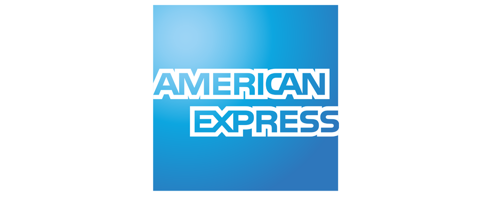
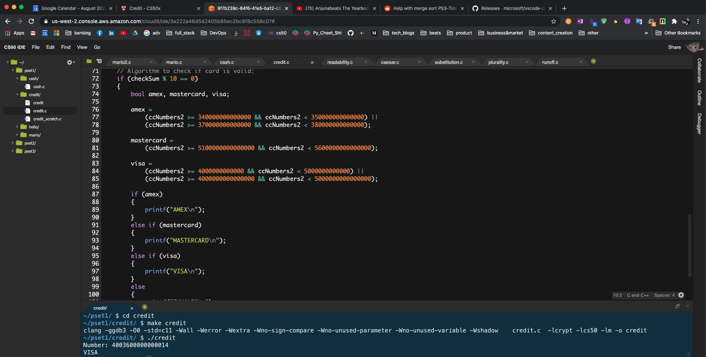

# Visa, Master Card and American Express Credit Card Checker in C Programming Lanuage
## August 2020

## Scope & Purpose

A credit (or debit) card, of course, is a plastic card with which you can pay for goods and services. Printed on that card is a number that’s also stored in a database somewhere, so that when your card is used to buy something, the creditor knows whom to bill. There are millions of people with credit cards in this world, so those numbers are pretty long: American Express uses 15-digit numbers, MasterCard uses 16-digit numbers, and Visa uses 13- and 16-digit numbers. Fun fact: American Express could print as many as 10^15 = 1,000,000,000,000,000 unique cards! (That’s, um, a quadrillion...)

For project, I programmed a credit card checker in C using Luhn's Algorithm. The program prompts the user for a credit card number and then reports in the command line terminal whether it is a valid American Express, MasterCard, or Visa card number, per the definitions of each’s format herein.

## Background: Luhn's Algorithm
Most cards use an algorithm invented by Hans Peter Luhn of IBM. According to Luhn’s algorithm, you can determine if a credit card number is (syntactically) valid as follows:

1) Multiply every other digit by 2, starting with the number’s second-to-last digit, and then add those products’ digits together.
2) Add the sum to the sum of the digits that weren’t multiplied by 2.
3) If the total’s last digit is 0 (or, put more formally, if the total modulo 10 is congruent to 0), the number is valid.

## Identifying Types of Cards:
Credit card numbers actually have some structure to them. All American Express numbers start with 34 or 37; most MasterCard numbers start with 51, 52, 53, 54, or 55 (they also have some other potential starting numbers which we won’t concern ourselves with for this problem); and all Visa numbers start with 4.

Credit card numbers also have a “checksum” built into them, a mathematical relationship between at least one number and others. That checksum enables computers (or humans who like math) to detect typos (e.g., transpositions), if not fraudulent numbers, without having to query a database, which can be slow. Of course, a dishonest mathematician could certainly craft a fake number that nonetheless respects the mathematical constraint, so a database lookup is still necessary for more rigorous checks.

## System Prerequisites To Get Started
* C Programming Language

## Sample Output:

## Personal Note

* Hope you enjoyed it. Thank you for your time!

## Author

* **Johneson Giang** - *Invidual Project* - [Github](https://github.com/jhustles)

## License

This project is licensed under the MIT License - see the [LICENSE.md](LICENSE.md) file for details

## Acknowledgments & Credits

* Shout out to Harvard's CS50 David J. Malan

* I definitely want to give a shout out to my dear teacher, mentor, and friend @CodingWithCorgis!